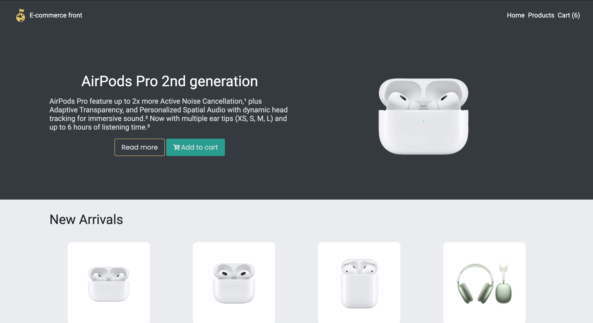

# E-Commerce Frontend

## Overview
The E-Commerce Frontend is a web application that serves as the user interface for an online e-commerce store. It provides a user-friendly platform for customers to browse, search for, and purchase products. This project is built using modern web technologies and follows best practices in web development.

## Features
- **Product Catalog:** Browse a wide range of products with detailed information.
- **Search Functionality:** Easily find products using the search bar.
- **Filtering Functionality:** Easily filter products by category or by color.
- **Product Details:** View detailed information about each product.
- **Shopping Cart:** Add products to your cart and proceed to checkout.
- **User Authentication:** Register and log in to your account.
- **Responsive Design:** Ensures a seamless experience on various devices.

## Installation
1. Clone this repository: `git clone https://github.com/EdwardTymoshuk/e-commerce-front.git`
2. Navigate to the project directory: `cd e-commerce-front`
3. Install dependencies: `npm install`

## Usage
- Start the development server: `npm run dev`
- Access the application in your browser at `http://localhost:3000`

## Technologies Used
- React: A JavaScript library for building user interfaces.
- Next.js: A framework for building React applications.
- Styled-components: A CSS-in-JS library for styling components.
- Axios: A promise-based HTTP client for making API requests.
- MongoDB: A document database with the scalability and flexibility that you want with the querying and indexing that you need.

## Contributing
Contributions are welcome! If you'd like to contribute to this project, please follow the standard GitHub fork and pull request process.

## Contact
For any inquiries or feedback, please contact the project owner:
- Eduard Tymoshuk
- Email: [eduard.tymoshuk@gmail.com](mailto:eduard.tymoshuk@gmail.com)
- GitHub: [https://github.com/EdwardTymoshuk](https://github.com/EdwardTymoshuk)
